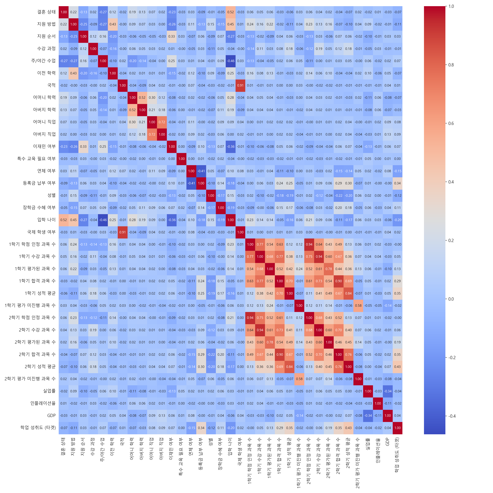
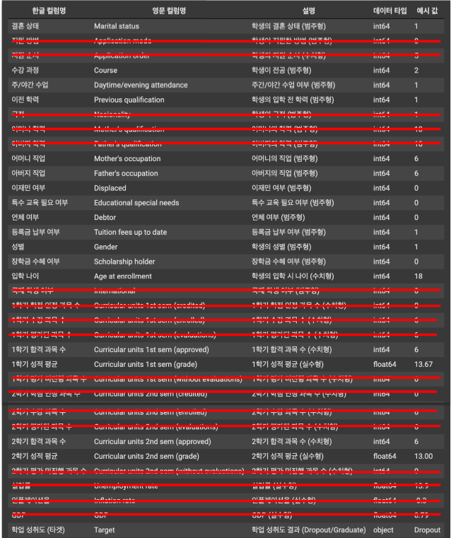
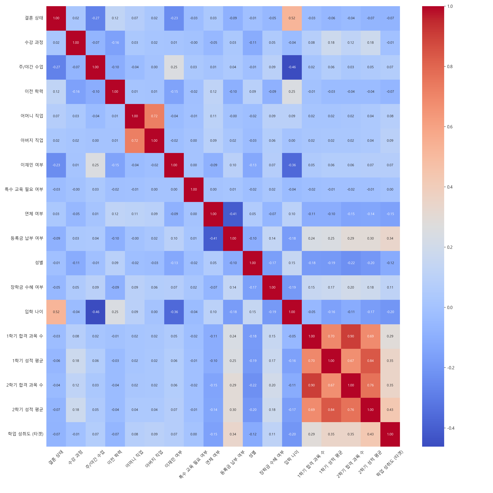

## SKN14-2nd-6Team

# 학생들의 학업 중도 이탈률 예측 


## **👥 팀원 소개**
### 팀명 : 자퇴 시그널 잡아조 ‼️

<table border="1" style="border-collapse: collapse; text-align: center; width: 100%;">
  <thead>
    <tr>
      <th style="padding: 10px; width: 120px; min-width: 50px">캐릭터</th>
      <th style="padding: 10px; width: 100px;">이름</th>
      <th style="padding: 10px; width: 320px;">담당 업무</th>
    </tr>
  </thead>
  <tbody>
    <tr>
      <td></td>
      <td>김의령</td>
      <td>EDA 취합 및 보고서 작성<br>피그마 페이지 설계 및 Streamlit 세부 UI 수정</td>
    </tr>
    <tr>
      <td></td>
      <td>김재우</td>
      <td>Streamlit 페이지 구성 및 세부 UI 수정</td>
    </tr>
    <tr>
      <td></td>
      <td>안윤지</td>
      <td>Streamlit 페이지 구성 및 세부 UI 수정</td>
    </tr>
    <tr>
      <td></td>
      <td>이승혁</td>
      <td>PPT제작 및 발표</td>
    </tr>
    <tr>
      <td></td>
      <td>조성렬</td>
      <td>머신러닝, 딥러닝 모델링 및 코드 취합 <br> README 작성</td>
    </tr>
  </tbody>
</table>


## 📖 WBS

| 작업 명             | 담당자                     | 산출물              |
|------------------|-------------------------|------------------|
| 프로젝트 주제 및 데이터 선정 | 김의령, 김재우, 안윤지, 이승혁, 조성렬                      | 없음               |
| 데이터 전처리 및 EDA    | 김의령, 김재우, 안윤지, 이승혁, 조성렬                      | 코드               |
| EDA 취합 및 보고서 작성  | 김의령                     | 코드, 마크다운         |
| 머신러닝 및 모델링       | 김의령, 김재우, 안윤지, 이승혁, 조성렬                      | 코드               |
| 머신러닝 코드 취합       | 조성렬                     | 코드               |
| Streamlit 구현     | 김의령, 김재우, 안윤지           | Streamlit 화면     |
| README.md 작성     | 조성렬                     | GitHub README|
| PPT 제작 및 발표      | 이승혁                     | html,Canva       |
| 최종 점검 및 회고       | 김의령, 김재우, 안윤지, 이승혁, 조성렬 | -                |


---

# 1. 프로젝트 개요 
   
## 1-1. 📌 프로젝트 소개

두번째 프로젝트는 학생들의 학업 중도 이탈(자퇴) 가능성을 예측하는 머신러닝 기반 분석 프로젝트입니다.

이 프로젝트는 학생 개개인의 다양한 배경과 학업 성취, 경제적·사회적 요인 등 35개 변수(이 중 18개 주요 변수 활용)를 바탕으로, 재학중인 학생이 졸업(Graduated), 자퇴(Dropout) 중 어느 경로를 밟을지 예측하는 것을 목표로 합니다.
데이터는 Kaggle의 "Predict students' dropout and academic success" 데이터셋(총 4,424개 샘플, 범주형/수치형 혼합)으로, 실제 고등교육 기관에서 학생의 이탈과 성공을 예측하는 데 사용되는 다양한 정보를 포함하고 있습니다.

또한 머신러닝 기반의 프로젝트지반 딥러닝도 일부 이용하여 예측도를 비교분석해봤습니다.

<br/><br/>


## 1-2. 데이터셋 소개

📂 사용 데이터: Predict students' dropout and academic success \
↳ Kaggle dataset: https://www.kaggle.com/datasets/thedevastator/higher-education-predictors-of-student-retention\
↳ 크기: 4424 개\
↳ 특성(컬럼): 총 35개 (범주형/수치형 혼합) / 이후 사용한 컬럼은 18개

<br/><br/>


---

# 2. 프로젝트

## 2-1. 프로젝트 구조
```
SKN14-2nd-6Team
│
├── 01_preprocessing_report/
│   └── Students'_EDA
│
├── 02_training_report/
│   ├── project.ipynb 
│   └── ├── data/
│          └── dataset.csv
│
├── 03_trained_model/ 
│   └── best_model.pkl
│
├── images/
│    ├── deep_learning.png
│    ├── delete_column.png
│    ├── heatmap_pre.png
│    └── heatmap_later.png
│
├──app.py
│
├──pages/
│     ├── input_form.py
│     └── result.py
│
├──.gitignore  
└── README.md/                        
```
           
---


## 2-2. 사용한 기술 스택
| 분류     | 기술도구                                                                                                                                                                                                                           |
|----------|-----------------------------------------------------------------------------------------------------------------------------------------------------------------------------------------------------------------------------------|
| 언어     |                      |
| 웹       |                                                                               |
| 사용기술 |  |
| 협업 툴  |     |


<br/><br/>

---

# 3. 📊 탐색적 데이터 분석 EDA

## 3-1. 상관행렬(Heatmap)


<br/><br/>
## 3-2. 필요없는 컬럼 제거



- 상관관계가 약하거나 다중공선성이 높은 컬럼은 불필요한 컬럼이라고 판단
- 지원방법, 지원순서, 국적, 사회/경제 지표(실업률,인플레이션,GDP), 학기별 과목 수 컬럼 제거

<br/><br/>
## 3-3. 상관행렬(Heatmap) 재확인



<br/><br/>
## 3-4. target 변수 범주화 처리 및 제거

- 'Dropout','Graduated','Enrolled' 를 각각 0,1,2로 범주화
- 'Enrolled'의 경우 머신러닝의 낮은 적합도에 영향을 미치는 것을 확인후 제거

<br/><br/>
## 3-5. 인코딩 작업
- Pipeline을 활용하여 인코딩 처리
  - 범주형 데이터: One-hot 인코딩 처리
  - 수치형 데이터: StandardScaler로 스케일링

---

# 4. 🤖 머신러닝 모델링 

## 4-1. 모델링 및 학습 결과

<br/>

### 📊 모델별 성능 비교 결과

| 모델명           | 최고 검증점수(CV) | 최고 파라미터 |
|------------------|-------------------|--------------|
| LGBMClassifier   | 0.9166            | subsample: 0.9, reg_lambda: 0.1, reg_alpha: 0, num_leaves: 20, n_estimators: 100, max_depth: 5, learning_rate: 0.1, colsample_bytree: 0.8 |

| 평가 지표                          | 값      |
|-------------------------------------|---------|
| Validation Accuracy (임계치 0.5)    | 0.9088  |
| Validation F1 Score (임계치 0.5)    | 0.9277  |


>> 하이퍼 파라미터에 LogisticRegression, SVC, KNeighbors, RandomForest, XGBoost, LightGBM, CatBoost 사용 <br>
>>  그 중 F1 스코어 기반의 검증 점수와 Best Param과 정확도를 보았을 때, LightGBM 모델을 선정. 

<br/><br/>

---


# 5. 딥러닝 모델링

## 5-1. 모델링 및 학습 결과

<br/>

| 지표             | 초기 값(에폭 1) | 최종 값(에폭 44) | 변화량     | 주요 관찰 사항              |
|------------------|----------------|------------------|-----------|----------------------------|
| Train Loss       | 0.6335         | 0.3204           | ▼ 49.4%   | 꾸준한 감소 추세           |
| Val Loss         | 0.5259         | 0.3325           | ▼ 36.8%   | 0.33 수준에서 안정화        |
| Train Accuracy   | 64.22%         | 88.44%           | ▲ 37.7%   | 지속적인 성능 향상         |
| Val Accuracy     | 78.69%         | 87.29%           | ▲ 10.9%   | 검증 성능 87% 수렴          |
| Learning Rate    | 0.001          | 0.000004         | ▼ 99.6%   | 효과적인 학습률 감소        |


<br/>

>> Scheduler, EarlyStopping, Dropout을 사용하여 진행 <br>
>> Epoch 44에서 Early Stopping 작동

<br/><br/>

---

# 6. Streamlit 구현

## 6-1. Streamlit 영상
### [시연 영상 youtube 링크]()

---
# 7. 예측 모델의 향후 활용 방안

## 7-1. 예측 모델의 향후 활용 방안
- 실시간 예측결과를 바탕으로 위험군 학생 조기 경보 및 선제적 대응 지원
- 예측 결과 기반으로 상담 및 프로그램 연계
---

# 8. 💭 한 줄 회고


|     이름      | 한 줄 회고                                                                                       |
|:-----------:|----------------------------------------------------------------------------------------------|
|     김의령     |                                                                                              |
|     김재우     |                                                                                              |
|     안윤지     |                                                                                              |
|     이승혁     |                                                                                              |
|     조성렬     | 머신러닝 예측모델을 저장하여 웹 상 구현까지 한건 처음이였는데 잘 마무리되어서 다행인것같습니다. 짧은 기간동안 고생해주신 팀원분들께 감사하다는 말씀 드리고 싶습니다. |


<br/><br/>
<br/><br/>
<br/><br/>
